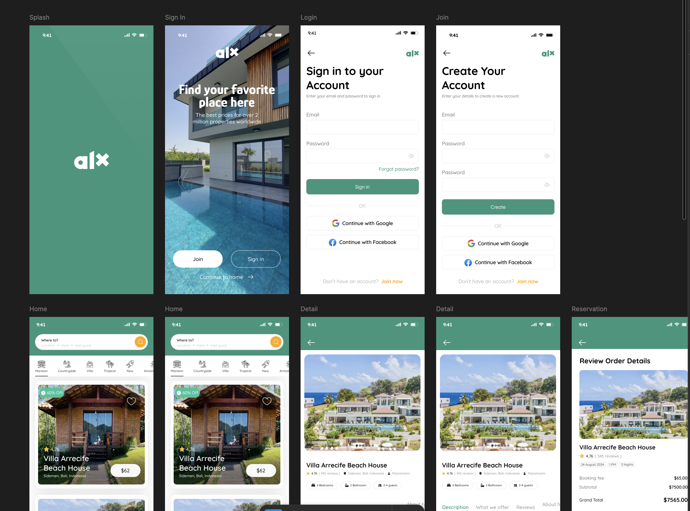

# Wireframing

## Introduction

Wireframing is the process of creating a visual guide or blueprint that represents the skeletal framework of a digital product — such as a website, web app, or mobile app. It helps designers, developers, and stakeholders visualize the layout, structure, and flow of content before design and development begin.

Wireframes focus on **functionality and layout**, not aesthetics. They act as a bridge between design ideas and technical execution, ensuring every stakeholder understands how the product will function at a structural level.

---

## Key Elements of a Wireframe

A good wireframe includes several essential components that define the user experience and layout:

- **Layout Structure:**  
  Defines how the page is organized (header, navigation, content, footer).  
  *Example:* A homepage layout might feature a top navigation bar, a hero section, and a grid of featured products or articles.

- **Navigation:**  
  Represents how users move through the product using links, buttons, or menus.  
  *Example:* A sidebar or top nav bar to help users switch between pages.

- **Content Placement:**  
  Shows where text, images, or call-to-action buttons will appear.  
  *Example:* Positioning “Sign Up” buttons near descriptive text to encourage conversions.

- **Functionality:**  
  Demonstrates how elements interact with users.  
  *Example:* Dropdowns, search bars, or modals to handle user input and feedback.
  
---

## 🎨 Types of Wireframes

### 1. Low-Fidelity Wireframes
- Focus on basic structure and functionality.  
- Usually use grayscale colors, boxes, and placeholder text.  
- Created quickly to explore layout ideas.  
- **Purpose:** Early design brainstorming and team alignment.

### 2. High-Fidelity Wireframes
- Include detailed visuals: colors, typography, and real content.  
- Closely resemble the final product.  
- **Purpose:** Late-stage refinement, prototyping, or usability testing.

### Type of Wireframe Used here: https://www.figma.com/design/E2BRqdPcKkrnX6hLGPto8Z/Project-Airbnb?node-id=1-2&p=f&t=O5urSEknj2RIKhqY-0

The figma represents a **High-Fidelity Wireframe**.

**Explanation:**
This wireframe goes beyond basic structure — it includes detailed UI components, color schemes, typography, real images, and realistic content. Each screen (such as *Splash, Login, Home,* and *Reservation*) visually communicates how the final mobile app will look and behave.

**Key Features That Indicate High Fidelity:**
- Real product images and icons.  
- Defined color palette and branding elements.  
- Actual text and button labels (e.g., *“Sign In”*, *“Book Now”*).  
- Detailed layouts with spacing, hierarchy, and interactive components.  
- Multiple connected screens showing the full user flow.

**Purpose:**
High-fidelity wireframes like this are typically used during **late design stages** — for user testing, stakeholder approval, and handoff to developers. They give a realistic view of the final product before coding begins.

**Wireframe Preview:**

---

## Wireframing Tools

Several tools make wireframing efficient and collaborative:

### **Figma**
- Cloud-based and ideal for real-time collaboration.  
- Supports both low- and high-fidelity wireframes.  
- Easy sharing and prototyping.  
- **Why Choose Figma:**  
  - Real-time co-editing.  
  - Developer handoff tools.  
  - Vector editing and responsive design features.

### **Other Popular Tools**
- **Balsamiq:** Best for quick, low-fidelity sketches.  
- **Adobe XD:** Ideal for high-fidelity, interactive prototypes.  
- **Sketch:** Favored by macOS users for UI/UX work.  
- **Miro:** Great for brainstorming wireframes with team collaboration.

---

## 💡 Benefits of Wireframing in Software Development

Wireframing offers several practical advantages throughout the development lifecycle:

1. **Clarifies Vision:** Aligns designers, developers, and stakeholders on layout and flow.
2. **Saves Time & Cost:** Identifies design flaws early before coding starts.
3. **Improves Communication:** Provides a clear visual language for discussion.
4. **Enhances UX:** Encourages usability-focused design from the start.
5. **Enables Feedback & Iteration:** Quick to adjust based on user or client feedback.

---

## Real-World Example

**Scenario:**  
A design team created a wireframe for a fashion eCommerce store. During testing, they discovered that users found the checkout form too long and confusing.

**Solution:**  
The team redesigned the wireframe to simplify checkout into three steps and added an auto-fill feature.

**Results:**  
- Checkout completion time reduced by **40%**.  
- User satisfaction improved.  
- Reduced post-development changes, saving time and cost.

---

## Conclusion
Wireframing is a critical step in the design process. It provides a foundation for clear communication, usability, and efficiency. Whether you’re creating a small app or a large web platform, a strong wireframe ensures the final product meets both user and business needs.
